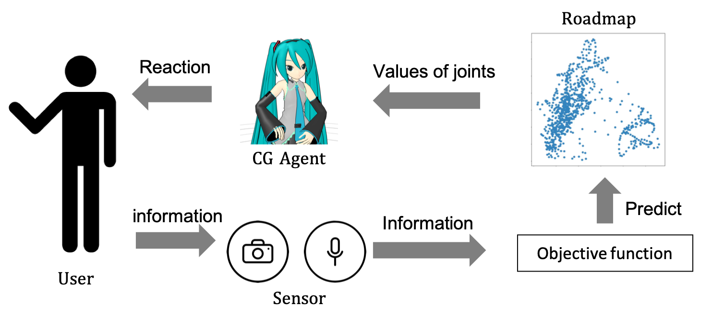
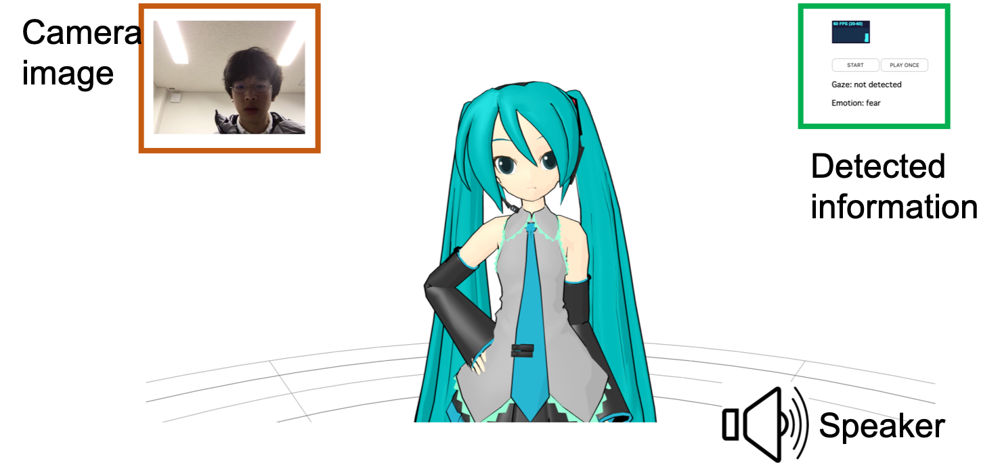

# Generate-motion-from-roadmap
Let's interact with virtual agent in the screen. Here's some procedure of how to create a roadmap and how to run this system.

## Dependency
* [OpenPose](https://github.com/CMU-Perceptual-Computing-Lab/openpose)
* [3DPoseBaseline](https://github.com/una-dinosauria/3d-pose-baseline)
* [PyQt](https://doc.qt.io/qtforpython/PySide2/QtGui/QQuaternion.html)
* [Flask](http://flask.pocoo.org/)
* [OpenFace](https://github.com/TadasBaltrusaitis/OpenFace)

## Installation & Quick Start
First download this repository ```git clone https://github.com/shiroshanshan/generate-motion-from-roadmap.git```

Then run ```python server/server.py``` to start server. You can set flag ```-p``` for plotting sampled data and ```-w``` for writing sampled data.

Now you can access https://127.0.0.1:5000 to interact with the agent.

## How to construct roadmap
* [Data process](docs/data.md)
* [Construct roadmap](docs/roadmap.md)

## System architecture
<p align="center">
    
</p>

## Interface
<p align="center">
    
</p>

## DEMO
<p align="center">
    
</p>

## Objective function (implementing)
Classified by Neural Network and predict by [free-energy principle](docs/free energy.pdf).

## Other Component
* [Gaze detection](https://github.com/TadasBaltrusaitis/OpenFace)
* [Emotion detection](https://ieeexplore.ieee.org/document/5946910)
* voice recognition (implementing)

# Tools  
* run ```python scripts/clear_output.py``` to clear all of the output during runtime.
* run ```python scripts/txt2csv.py``` to write out mmd csv file from joint angles.
* run ```python scripts/create_routes.py``` everytime roadmap be modified.
*  run ```python script/mmd2ibk.py``` to convert mmd csv file to [ibuki](https://github.com/ustyui/silva/tree/master/silva_beta) csv file.
*  run ```python script/plot/animation.py``` to write out gif animation from joint angles (decrease the dimension to 2 by PCA).

## Reference
Thanks to [ArashHosseini](https://github.com/ArashHosseini/3d-pose-baseline/) and  [errno-mmd](https://github.com/errno-mmd/VMD-Lifting).
