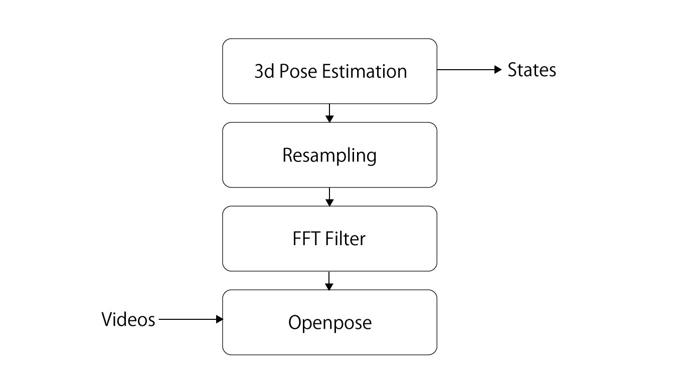
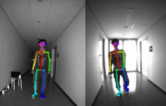

# Data process
Data used at constructing roadmap will be saved in this folder.

<p align="center">
    
</p>

video => 2dpose => 3dpose => rotation

## video
video of human human interaction is recorded by [intel euclid](https://www.euclidcommunity.intel.com/) @30 fps. And you can preview the sample video in the video folder. Data is save at directory of ```video/$TIMESTAMP/$INDEX.avi```.
<p align="center">
    
</p>

## 2dpose
Extracted 2d joint position from video@30 fps by [OpenPose](https://github.com/CMU-Perceptual-Computing-Lab/openpose), and to stabilize the result, median filter and resampling is being used after the process of [OpenPose](https://github.com/CMU-Perceptual-Computing-Lab/openpose). Data is save at directory of ```2dpose/$TIMESTAMP/$INDEX/$FRAME.json```.
<p align="center">
    
</p>

## 3dpose
Then estimate 3d joint position from 2d position data by [3DPoseBaseline](https://github.com/una-dinosauria/3d-pose-baseline). Data is save at directory of ```3dpose/$TIMESTAMP$INDEX.txt```.

3d joint position of left person.
<p align="center">
    
</p>

## rotation
Joint angle is calculated by quaternion. Data is save at directory of ```rotation/$TIMESTAMP$INDEX.txt```.
